```{r include=FALSE, echo=FALSE, warning=FALSE, message=FALSE, eval=T}
knitr::opts_chunk$set(include=FALSE, echo=FALSE, warning=FALSE, message=FALSE)
library(shiny)
library(shinyWidgets)
```

# Introduction  

The Cadastral Crawler leverages the 1:m relationship between owner names and registered address to crawl through the cadastral record horizontally, building a directed graph network of the relationship between owner names and their registered addresses.

# Step 1: Search Owner Names  

Our analysis begins when we enter the name of a landowner in the search box and query the cadastral data. Land owner searches are case insensitive and they are automatically encased in wild cards because the precise string for a landowner can be recorded slightly differently for each parcel - typos are fequent in the original data, and standardization methods differ by county - so searching on  partial names are likely to produce better results. 

For this Tutorial, we are going to use the Deseret Ranches, which is a subsidiary corporation of the Mormon Church. [The Mormon Church is now one of the largest land owners in Florida, and owns an estimated 2% of the total landmass in the state](https://www.reuters.com/article/usa-florida-mormons/mormon-church-set-to-become-floridas-largest-private-landowner-idUSL2N0IT2AZ20131108).  
  
To begin our analysis, we are going to enter the string "deseret" into the search box and hit the QUERY DATA button. Once the search begins, a message window will pop up. Since there are more than 10 million individual parcel records in the State of Florida, searching it can take a few moments.  
  
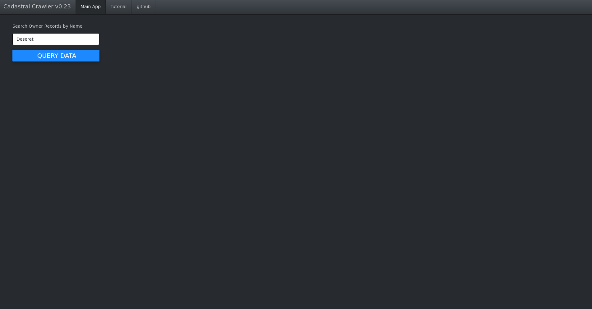  

## Step 2: Select Owner Names  

When our search is done, a new control will appear below the blue QUERY DATA button that allows us to interact with the results of our query.  

Clicking on the control will show us 5 results:  

  + DESERET RANCHES OF N FL LLC  
  + DEJESUS DESERET M  
  + DESERET HOLDINGS LLC  
  + DESERET RANCHES OF NORTH FL  
  + DESERET RANCHES OF NORTH FL LL  

Typing in a new string into the white box at the top of this control allows us to search within our query results - this is useful when lots of potential matches are returned by a search. Clicking on any individual entry on this control will allow us to identify it as a match, and a check mark will appear next to the entry. The SELECT ALL and SELECT NONE controls should be self-explanatory.  

For this tutorial, we want to select 4 of our 5 results so that the box appears as it does in the **STEP 2** image above, ie we want to include everything but the DEJESUS DESERET M entry. Once we have selected one or more entries from this list, click anywhere off the control to minimize it.  
  
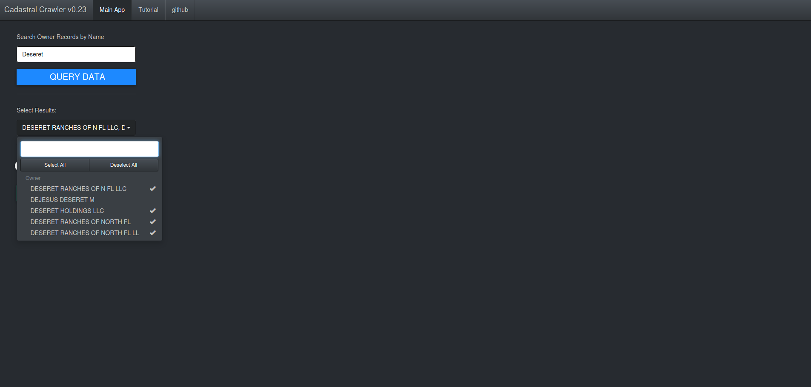

## Step 3: Select output and trigger algorithm  

After selecting our desired matches, two new controls will appear: the "Use Ordered Discovered" toggle and the CRAWL DATA button.  
  
The toggle allows us to select how we want to build the output of the crawling algorithm - as a true directed network, or as a heirarchical tree that shows us the order in which each item was discovered. As a general rule, keeping this toggle in the OFF position results in better network diagrams, but the results of the algorithm tend to be easier to understand when they are graphed in the order in which the algorithm discovered.  

For this tutorial, we want to toggle the "Use Ordered Discovered" button as in the image below and hit the CRAWL DATA button to start the algorithm. Building a directed graph network can take time, depending on how many results are found.  **VERY IMPORTANT:** In order to limit the strain on the server, all searches are limited to a search depth of no more than 5 levels or 150 nodes, whichever comes first. Be aware that you might not be seeing the true output of an unrestricted search!  

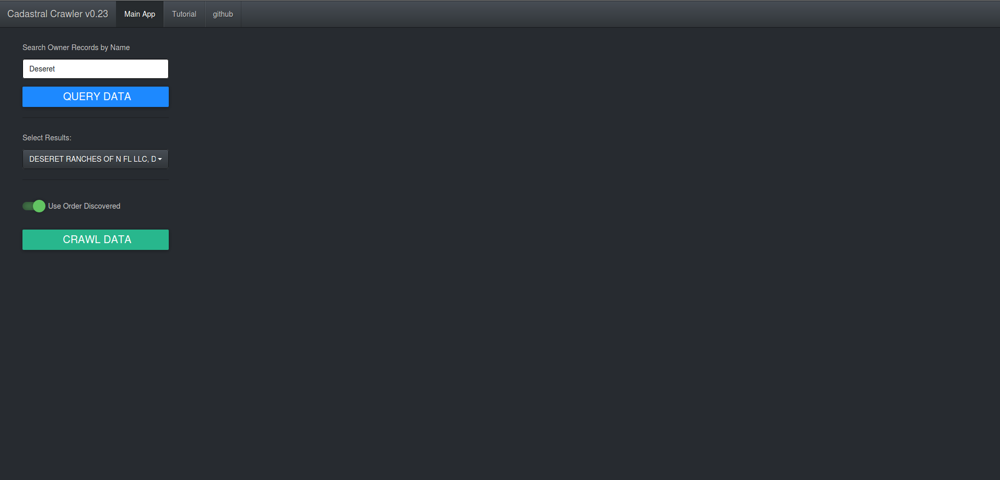

 
  
## Step 4a: Ordered Results  

Once the crawler algorithm has completed its search, several new controls and two new windows will appear on the screen.  
  
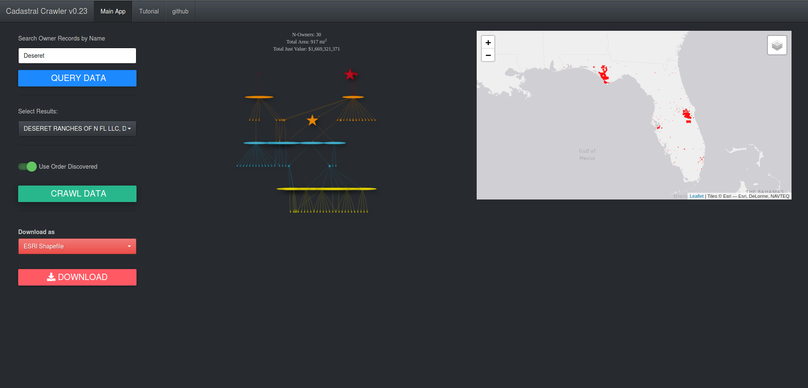  
  
In the bottom left hand corner of the screen, two new controls in red have been added to the panel on the left: a drop down to select an output type, and a download button. These will allow you to download the cadastral records returned by the search in a format of your choosing.  
 
In the center panel, we see the results of the crawler algorithm as either a directed graph or a heirarchical tree, and on the right hand panel we see a webmap showing the locations of the parcels returned by our results. Both of these panels are interactive and offer options for exploring the results produced by the crawler algorithm.  
  
For the moment, we want to interact with the results in the center panel that displays the graph network of results. Hover your mouse over the large red star in the top left of the network graph, and use the center wheel to zoom in to the top right corner (on mobile you will use a "reverse pinch"). 

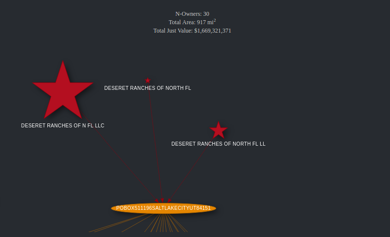  
  
If the labels for the nodes overlap, you click and drag them rearrange the them so the labels are easier to read.  

Nodes in the center panel output are classified by shape, color, and size.  
  
  + Colors denote the search depth at which a set of owner names or owner addresses were discovered, with each search depth being assigned its own color. These are currently red orange, blue, yellow for depths 1, 2, 3 and 4 respectively, but this might change in the future.  
  + Shapes indicate the type of node. Stars indicated an owner name, and ellipses indicate an owner address.  
  + The size of a star indicates the relative land area registered to that owner name.  
  
The image above is telling us that all of the parcels registered under DESERET RANCHES OF N FL LLC, DESERET RANCHES OF NORTH FL, and DESERET RANCHES OF NORTH FL LL are registered to the same address: PO Box 511196, Salt Lake City, Utah.  
  
Hovering over a star will produce a popup with some basic statistics about the landowner. 
  
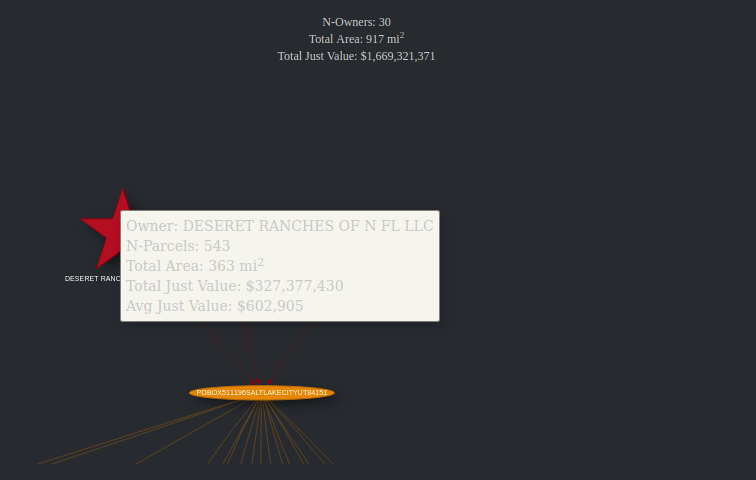  

Single clicking on a node will add a new "Selected Parcels" layer to the map, grey out anything in the graph network not directly related to that node, and automatically zoom in to the bounding box of the parcels on the web map.  
  
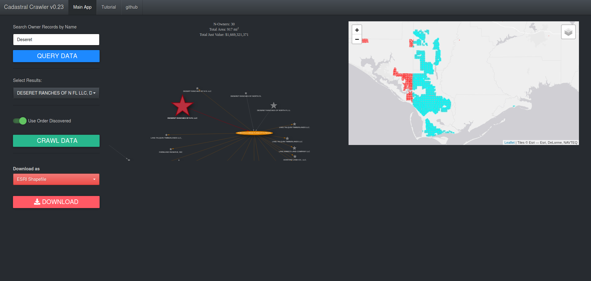  

  
Clicking and dragging allows us to navigate around the graph network visualization.  
  
If we pan to the left to view the other top level node in our tree, we see that DESERET HOLDINGS LLC registers their parcels to a different address: 160 Green Tree Dr, Suite 101, Dover Dellaware 19904.  
  
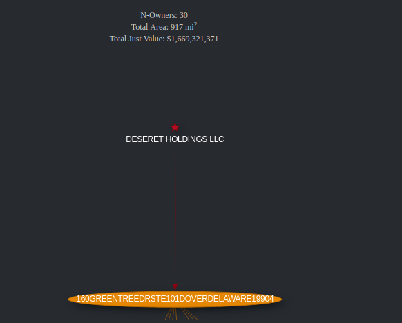  
  
It seems intuitively obvious that the three Deseret Ranches nodes are related - each is simply a variation on the same name, and each is registered to the same address.  
  
But are Deseret Holdings and Deseret Ranches related? To answer this, we examine the second and third levels of the graph network.  
  
After some rearranging, the second level looks something like this:  
  
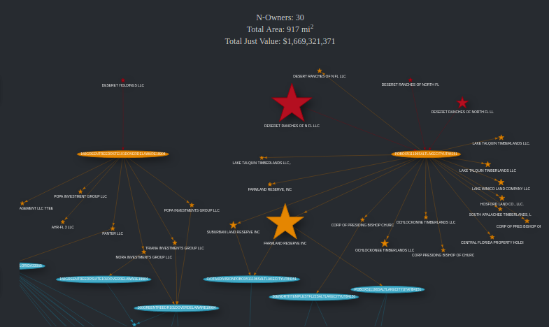  

Here we see that the crawler algorithm has successfull captured a second legal entity the Mormon church uses to purchase land in central Florida - Farmland Reserve, Inc., which owns 467 miles in Central Florid - because Farmland Reserve also registers parcels to the PO Box 511196 address in Salt Lake City.  
  
(Note that since we graphed by ordered discovered, the arrows indicate how the algorithm discovered eaech successive owner name or address - not the true directed graph relationship between these nodes. More on this in a minute.)  

We can also see that the nodes that were discovered under 'DESERET HOLDINGS LLC' are distinct, and not connected to the nodes that connect to Farmland Reserve or Deseret Ranges of North Florida. Absense of evidence is not conclusive by any means, but tentatively speaking the lack of connection between the two graphs indicates that Deseret Holdings is a seperate entitiy altogether.  
  
## Step 4b: Unordered Results  
  
The ordered results toggle can help us understand the order in which the algorithm discovered each node, but it doesn't indicate the true relationship between parcel owners (stars) and owner addresses (ellipses). It also has some overlap problems when a high number of nodes are discovered.  
 
Let's try letting the crawler build a true directed graph that is unordered. Deselect the "Use Order Discovered" toggle and hit the CRAWL DATA button to produce a new directed graph.  
  
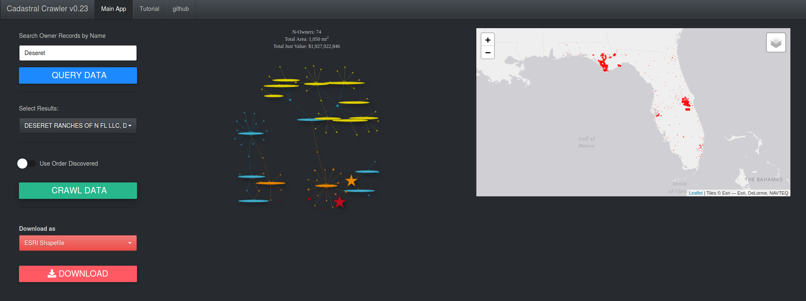  
  
This style of graph shows the relationships between owner names and registered addresses more clearly - all of the stars point to an ellipse, with some stars (owner names) pointing to multiple ellipses (addresses).  It also makes it a bit clearer that nodes related to DESERET HOLDINGS LLC are distinct from the DESERET RANCHES OF N FLORIDA nodes, at least out to the maximum search depth.  
  
Zooming in to the large, red DESERET RANCHES OF N FL LLC start tells us about the relationships between these various entities in more detail.  
  
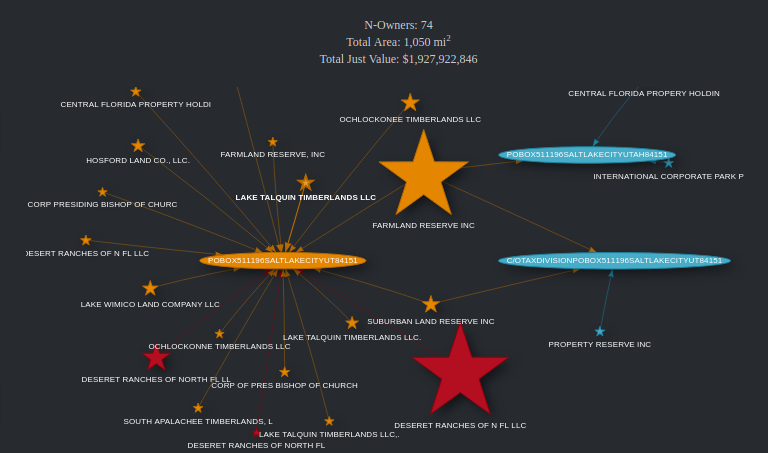  
Here, we can see that numerous entities - Deseret Ranches, Farmalnd Reserve, Lake Talquin Timberlands, Suburban Land Reserve Inc, Lake Wimico Land Company, Corp of the Pres Bishop of Church (note this is truncated in the orginal data and should continue with some variant of OF LATTER DAY SAINTS), and others - all have registered parcels to the same PO Box in Salt Lake City, Utah. These appear to be ongoing business concerns related to property buys conducted by the church. 

On the other hand, most of the nodes in blue and yellow tend to be properties that are actual churches.  
  
The exceptions to this are Property Reserve Inc, which appears to be yet another land holding holding company along the line of Farmland Reserve and Suburban Reserve.  
  
# Final Thoughts  and Caveats  

This is an exploratory tool, designed to help discover relationships between land owning entities. Results should always be taken with a grain of salt - you should definitely explore any linkages you find through other avenues before concluding that there are definite relationships between various entities. String matching is also difficult to do programatically; future revisions that use fuzzy string matching and allow you modify nodes and re-run the algorithm are planned.  

Nevertheless, I hope you find this tool useful, despite it's rather rough and ready nature. I think it has quite a bit to offer when exploring linkages in the land ownership records.  


  

  

  

  


  

  

  
